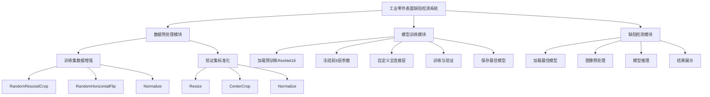

# 🏭 基于 ResNet 的工业零件表面缺陷分类系统

> 基于 PyTorch 和 ResNet18 的工业零件表面缺陷智能检测系统，验证集准确率达到 98.33%


## ✨ 项目简介

本项目是《人工智能应用技术》期末课程作业，实现了一套基于 **ResNet18** 深度学习模型的工业零件表面缺陷智能检测系统。系统采用迁移学习策略，利用在 ImageNet 大规模数据集上预训练的 ResNet18 模型作为基础，通过冻结前 8 层参数并自定义全连接层的方式，实现了对 6 类工业零件表面缺陷的高精度分类。

### 🎯 核心特性

- 🚀 **高精度检测**：验证集准确率达到 **98.33%**，各类别 F1 分数均不低于 0.95
- 🔄 **迁移学习**：利用 ImageNet 预训练模型，在小样本情况下取得优异性能
- ❄️ **参数冻结**：冻结前 8 层参数，仅训练全连接层，提高训练效率
- 🎨 **数据增强**：采用 RandomResizedCrop 和 RandomHorizontalFlip 提高模型泛化能力
- 🌐 **Web 演示**：基于 Streamlit 的友好 Web 界面，支持实时缺陷检测
- 📊 **可视化分析**：自动生成训练曲线，支持各类别性能分析

### 🏭 支持的缺陷类型

| 英文类别 | 中文名称 | 描述 |
|---------|---------|------|
| crazing | 裂纹 | 表面出现细小裂纹 |
| inclusion | 夹杂 | 表面嵌入异物 |
| patches | 斑块 | 表面出现斑块状缺陷 |
| pitted_surface | 麻点 | 表面出现细小凹坑 |
| rolled-in_scale | 氧化皮 | 表面氧化形成的鳞片 |
| scratches | 划痕 | 表面被划伤的痕迹 |

## 🛠️ 技术栈

| 技术 | 版本 | 说明 |
|-----|------|------|
| Python | 3.9+ | 编程语言 |
| PyTorch | 2.8.0 | 深度学习框架 |
| Torchvision | 0.23.0 | 计算机视觉库 |
| Streamlit | 1.50.0 | Web 应用框架 |
| Matplotlib | 3.9.4 | 数据可视化 |
| Scikit-learn | 1.6.1 | 机器学习库 |
| NumPy | 2.0.2 | 数值计算库 |
| PIL | 11.3.0 | 图像处理库 |

## 📊 实验结果

### 总体性能

- **验证集准确率**：98.33%
- **训练集准确率**：92.92%
- **训练轮数**：15 epochs
- **训练时间**：约 15 分钟（CPU）
- **推理时间**：< 0.1 秒/张

### 各类别性能

| 缺陷类别 | 精确率 | 召回率 | F1 分数 |
|---------|--------|--------|---------|
| Crazing（裂纹） | 100% | 100% | 1.00 |
| Inclusion（夹杂） | 100% | 90% | 0.95 |
| Patches（斑块） | 100% | 100% | 1.00 |
| Pitted_surface（麻点） | 100% | 100% | 1.00 |
| Rolled-in_scale（氧化皮） | 100% | 100% | 1.00 |
| Scratches（划痕） | 91% | 100% | 0.95 |

## 🚀 快速开始

### 环境要求

- Python 3.9+
- PyTorch 2.0+
- 4GB+ 内存
- （可选）CUDA 兼容 GPU

### 安装步骤

#### 1. 克隆仓库

```bash
git clone https://github.com/yourusername/resnet-defect-detection.git
cd resnet-defect-detection
```

#### 2. 创建 Conda 环境

```bash
# 创建并激活 conda 环境
conda create -n uu python=3.9 -y
conda activate uu
```

#### 3. 安装依赖包

```bash
# 使用清华源加速安装（推荐国内用户）
pip install torch torchvision matplotlib tqdm scikit-learn streamlit pillow -i https://pypi.tuna.tsinghua.edu.cn/simple
```

或使用 requirements.txt：

```bash
pip install -r requirements.txt
```

#### 4. 准备数据集

确保数据集按以下结构组织：

```
./data/
├── train/
│   └── images/
│       ├── crazing/
│       ├── inclusion/
│       ├── patches/
│       ├── pitted_surface/
│       ├── rolled-in_scale/
│       └── scratches/
└── validation/
    └── images/
        ├── crazing/
        ├── inclusion/
        ├── patches/
        ├── pitted_surface/
        ├── rolled-in_scale/
        └── scratches/
```

#### 5. 训练模型

**方式一：使用启动脚本（推荐）**

- **Mac/Linux**：
  ```bash
  ./train.sh
  ```
- **Windows**：
  ```cmd
  train.bat
  ```

**方式二：直接运行 Python 脚本**

```bash
python train.py
```

训练完成后将生成：
- `best_model.pth` - 最佳模型权重
- `training_curve.png` - 训练曲线图

#### 6. 运行 Web 演示

**方式一：使用启动脚本（推荐）**

- **Mac/Linux**：
  ```bash
  ./run.sh
  ```
- **Windows**：
  ```cmd
  run.bat
  ```

**方式二：直接运行 Streamlit**

```bash
streamlit run app.py
```

浏览器将自动打开 `http://localhost:8501`

**停止 Web 服务**：在运行终端按 `Ctrl+C` 即可停止

#### 7. 打包成独立应用程序（可选）

**方式一：使用 GitHub Actions 自动构建（推荐）**

推送到 GitHub 后，GitHub Actions 会自动构建三个平台的可执行文件：

- **Windows**: `工业零件表面缺陷检测.exe`
- **macOS**: `工业零件表面缺陷检测`
- **Linux**: `工业零件表面缺陷检测`

详细说明请参考：[`GITHUB_ACTIONS_GUIDE.md`](GITHUB_ACTIONS_GUIDE.md:1)

**方式二：本地打包**

```bash
# 激活 conda 环境
conda activate uu

# 运行打包脚本
./build_app.sh
```

打包完成后，可执行文件位于 `dist/工业零件表面缺陷检测`，可以直接双击运行。

**详细说明**：请参考 [`PACKAGING_GUIDE.md`](PACKAGING_GUIDE.md:1)

打包功能包括：
- ✅ 独立运行，无需安装 Python
- ✅ 一键启动，双击即可运行
- ✅ 自动打开浏览器
- ✅ 便携性好，可复制到其他 Mac

## 📁 项目结构

```
resnet-defect-detection/
├── app.py                          # Streamlit Web 演示应用
├── train.py                        # 训练脚本
├── test_app.py                     # 测试脚本
├── requirements.txt                # Python 依赖列表
├── README.md                      # 项目说明文档（本文件）
├── best_model.pth                 # 训练好的最佳模型
├── training_curve.png             # 训练曲线图
├── run.sh                         # Mac/Linux 启动脚本
├── run.bat                        # Windows 启动脚本
├── train.sh                       # Mac/Linux 训练脚本
├── train.bat                      # Windows 训练脚本
├── launcher.py                    # 应用启动器（用于打包）
├── defect_detection.spec          # PyInstaller 打包配置
├── build_app.sh                   # macOS 应用打包脚本
├── PACKAGING_GUIDE.md             # 应用打包指南
├── GITHUB_ACTIONS_GUIDE.md        # GitHub Actions 自动构建指南
├── .github/                       # GitHub Actions 配置
│   └── workflows/
│       └── build.yml              # 自动构建工作流
├── .gitignore                     # Git 忽略文件配置
├── data/                          # 数据集目录
│   ├── train/
│   │   └── images/
│   │       ├── crazing/
│   │       ├── inclusion/
│   │       ├── patches/
│   │       ├── pitted_surface/
│   │       ├── rolled-in_scale/
│   │       └── scratches/
│   └── validation/
│       └── images/
│           ├── crazing/
│           ├── inclusion/
│           ├── patches/
│           ├── pitted_surface/
│           ├── rolled-in_scale/
│           └── scratches/
└── plans/                         # 文档目录
    ├── course_paper.md             # 课程论文核心章节
    ├── final_course_paper.md       # 完整课程设计论文（初版）
    ├── final_course_paper_v2.md     # 完整课程设计论文（更新版）
    ├── final_course_paper_v3.md     # 完整课程设计论文（最终版）
    ├── system_test_results.md        # 系统测试结果表格
    ├── paper_content.md            # 论文素材
    └── ppt_outline.md              # PPT 大纲（29页详细内容）
```

## 🚀 快速启动指南

### 一键启动脚本

为了方便 Mac 和 Windows 用户，项目提供了以下启动脚本：

#### Mac/Linux 用户

**训练模型**：
```bash
./train.sh
```

**启动 Web 演示**：
```bash
./run.sh
```

#### Windows 用户

**训练模型**：
```cmd
train.bat
```

**启动 Web 演示**：
```cmd
run.bat
```

#### 停止 Web 服务

在运行终端按 `Ctrl+C` 即可停止 Streamlit 服务

#### 脚本功能说明

- ✅ 自动检测并创建 conda 环境（如果不存在）
- ✅ 自动激活 conda 环境
- ✅ 检查依赖包是否安装
- ✅ 检查必要文件是否存在
- ✅ 如果没有训练模型，会自动提示先训练
- ✅ 友好的中文提示信息

## 🔧 核心功能

### 1. 模型训练（train.py）

完整的训练脚本，包含以下功能：

- ✅ 数据加载与预处理
- ✅ ResNet18 模型加载与参数冻结
- ✅ 自定义全连接层设计
- ✅ SGD 优化器配置
- ✅ 训练循环与验证
- ✅ 最佳模型保存
- ✅ 训练曲线可视化
- ✅ 各类别性能评估

**使用方法**：

```bash
python train.py
```

### 2. Web 演示（app.py）

基于 Streamlit 的 Web 演示应用，包含以下功能：

- ✅ 美观的侧边栏布局
- ✅ 图片上传功能（支持 JPG/PNG/BMP）
- ✅ 实时缺陷检测
- ✅ 预测结果展示（中英文）
- ✅ 置信度显示
- ✅ 各类别概率分布可视化
- ✅ 详细数据表格
- ✅ 模型缓存加速

**使用方法**：

```bash
streamlit run app.py
```

### 3. 模型测试（test_app.py）

测试脚本，用于验证模型加载和推理功能：

- ✅ 模型加载测试
- ✅ 图像预处理测试
- ✅ 模型推理测试
- ✅ 结果输出测试

**使用方法**：

```bash
python test_app.py
```

## 📖 系统架构



## 🎓 核心代码说明

### 模型构建

```python
# 加载预训练的 ResNet18 模型
model = models.resnet18(pretrained=True)

# 冻结前8层参数（除全连接层外）
for name, param in model.named_parameters():
    if 'fc' not in name:  # 冻结所有非fc层的参数
        param.requires_grad = False

# 获取原始全连接层的输入特征数
num_ftrs = model.fc.in_features

# 修改全连接层（考核要求：Linear(输入,256) -> ReLU -> Linear(256,6)）
model.fc = nn.Sequential(
    nn.Linear(num_ftrs, 256),   # 第一层全连接：输入特征 -> 256维
    nn.ReLU(),                   # ReLU激活函数
    nn.Linear(256, 6)           # 第二层全连接：256维 -> 6类缺陷
)

# 将模型移动到GPU（如果可用）
device = torch.device('cuda' if torch.cuda.is_available() else 'cpu')
model = model.to(device)
```

### 数据预处理

```python
# 训练集：包含数据增强
data_transforms = {
    'train': transforms.Compose([
        transforms.RandomResizedCrop(224),      # 随机裁剪并调整为224x224（数据增强）
        transforms.RandomHorizontalFlip(),      # 随机水平翻转（数据增强）
        transforms.ToTensor(),                  # 转换为Tensor
        transforms.Normalize([0.485, 0.456, 0.406], [0.229, 0.224, 0.225])  # ImageNet标准化
    ]),
    'validation': transforms.Compose([
        transforms.Resize(256),                 # 调整大小为256
        transforms.CenterCrop(224),             # 中心裁剪为224x224
        transforms.ToTensor(),                  # 转换为Tensor
        transforms.Normalize([0.485, 0.456, 0.406], [0.229, 0.224, 0.225])  # ImageNet标准化
    ]),
}
```

### 训练配置

```python
# 损失函数：交叉熵损失函数
criterion = nn.CrossEntropyLoss()

# 优化器：SGD（随机梯度下降）
optimizer = optim.SGD(filter(lambda p: p.requires_grad, model.parameters()), 
                      lr=0.001, 
                      momentum=0.9)  # SGD优化器

# 训练轮数
num_epochs = 15

# 批次大小
batch_size = 16
```

## 📈 训练过程

### 训练曲线

训练过程中的 Loss 和 Accuracy 曲线如下：

- **Loss 曲线**：训练集和验证集 Loss 随 epoch 变化
- **Accuracy 曲线**：训练集和验证集准确率随 epoch 变化

训练曲线图保存在 `training_curve.png`，可用于论文插图。

### 收敛分析

- **第 1 轮**：验证集准确率 90%
- **第 5 轮**：验证集准确率 94.72%
- **第 10 轮**：验证集准确率 95.00%
- **第 14 轮**：验证集准确率 98.33%（最高）

模型在前 5 轮训练中准确率提升最为明显，在第 11-15 轮中趋于稳定。

## 🌐 GitHub Actions 自动构建

本项目支持使用 GitHub Actions 自动构建跨平台可执行文件。

### 自动构建功能

推送到 GitHub 后，GitHub Actions 会自动构建三个平台的可执行文件：

| 平台 | 可执行文件名 | 说明 |
|------|-------------|------|
| Windows | `工业零件表面缺陷检测.exe` | `.exe` 可执行文件 |
| macOS | `工业零件表面缺陷检测` | macOS 可执行文件 |
| Linux | `工业零件表面缺陷检测` | Linux 可执行文件 |

### 使用方法

1. **推送到 GitHub**：
   ```bash
   git add .
   git commit -m "Initial commit"
   git push -u origin main
   ```

2. **查看构建状态**：
   - 访问仓库的 **Actions** 页面
   - 查看最新的工作流运行状态

3. **下载构建产物**：
   - 从 **Actions** 页面下载构建产物
   - 或从 **Releases** 页面下载（如果创建了版本标签）

### 触发条件

- ✅ 推送代码到 `main` 或 `master` 分支
- ✅ 创建 Pull Request
- ✅ 推送版本标签（如 `v1.0.0`）
- ✅ 手动触发（通过 GitHub 网页界面）

### 详细说明

完整的 GitHub Actions 使用指南请参考：[`GITHUB_ACTIONS_GUIDE.md`](GITHUB_ACTIONS_GUIDE.md:1)

## 📚 文档

### 课程论文

课程论文核心章节位于 `plans/` 目录：

- `course_paper.md` - 课程论文核心章节
- `final_course_paper.md` - 完整课程设计论文（初版）
- `final_course_paper_v2.md` - 完整课程设计论文（更新版）
- `final_course_paper_v3.md` - 完整课程设计论文（最终版，推荐使用）

论文包含以下章节：

1. **摘要**：研究背景、方法概述、实验结果
2. **引言**：研究背景、研究意义、本文结构
3. **相关工作**：深度学习在缺陷检测中的应用、ResNet 网络概述
4. **系统总体设计**：系统架构、工作流程、技术选型
5. **详细设计**：数据集、数据预处理、模型架构、训练策略
6. **实验结果与分析**：实验环境、实验设置、总体性能、各类别性能分析
7. **总结与展望**：总结、创新点、不足与展望
8. **参考文献**：15 篇中文文献
9. **致谢**：感谢指导教师和同学

### PPT 大纲

PPT 大纲位于 `plans/ppt_outline.md`，包含 29 页详细内容：

- **第一部分**：项目概述（5 页）
- **第二部分**：技术方案（9 页）
- **第三部分**：系统实现（5 页）
- **第四部分**：实验结果（6 页）
- **第五部分**：总结与展望（4 页）

每页包含详细的内容说明、设计建议和演讲时间分配。

## 🤝 贡献指南

欢迎贡献代码、报告 Bug 或提出新功能建议！

### 如何贡献

1. Fork 本仓库
2. 创建特性分支 (`git checkout -b feature/AmazingFeature`)
3. 提交更改 (`git commit -m 'Add some AmazingFeature'`)
4. 推送到分支 (`git push origin feature/AmazingFeature`)
5. 开启 Pull Request

### 开发规范

- 遵循 PEP 8 代码风格
- 添加适当的注释和文档
- 编写单元测试
- 确保代码通过 lint 检查

## 📄 许可证

本项目采用 MIT 许可证 - 详见 [LICENSE](LICENSE) 文件

## 👨‍💻 作者

《人工智能应用技术》课程作业

## 🙏 致谢

感谢《人工智能应用技术》课程任课教师的悉心指导，感谢同学们在学习和实验过程中提供的帮助和支持。同时感谢开源社区提供的优秀工具和框架（PyTorch、Streamlit 等），为本研究提供了强有力的技术支持。

## 📞 联系方式

如有问题或建议，欢迎通过以下方式联系：

- 提交 Issue
- 发送 Pull Request

## ⭐ Star History

如果本项目对你有帮助，请给个 Star ⭐

---

<div align="center">

**Made with ❤️ by [Your Name]**

[⬆ Back to Top](#readme)

</div>
